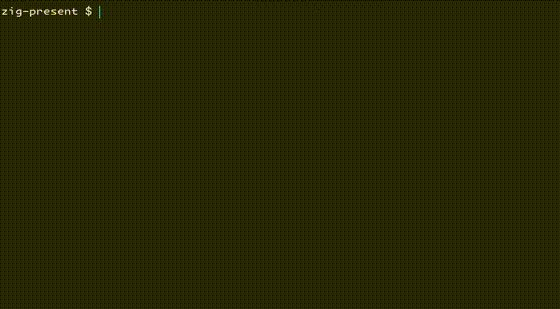

# zig-present

`zig-present` is a command-line tool for creating interactive TUI presentations.

<div style="max-width: 100%; margin: 0 auto; width: 800px;">



</div>

## Example

Presentations are expressed in a simple text format. Here's an example presentation:

```txt
!zig-present
# Coffee Brewing

How to brew coffee with a french press

/next_slide

# What you'll need:

- French press
- Ground coffee beans
- Boiling water

/next_slide

# Steps

1. Add ground coffee beans to the french press
2. Add 1 cup of boiling water to the french press, per 7g of coffee beans
3. Cover the french press with the lid
4. Wait 8 minutes
5. Push the plunger down slowly
6. Pour and enjoy
```

## Requirements

- Officially supported Zig: `Zig 0.13.0-dev.351+64ef45eb0` (you can get it from the [Zig Releases page](https://ziglang.org/download/))

## Installation

Use Zig to build the application binary. With a shell open in this project's directory:

```
zig build -Doptimize=ReleaseSafe
```

The binary will be available at `zig-out/bin/zig-present`.

## Usage

See the [Example](#example) for a sample presentation file or the [Presentation](#presentation) section for info on the available presentation commands. Store this in a file with the .txt extension, like `presentation.txt`. Then, you can start the presentation like this:

```
$ zig-present presentation.txt
```

## Presentation

Every zig-present file must start with the line `!zig-present`.

Lines starting with a `/` denote a command. All other lines are interpreted as text to print (empty lines and whitespace are preserved).

The most important command is `/next_slide`, which effectively creates a new slide within the presentation. See [Commands](#commands) for all of the commands.

## Commands

A presentation file can contain pre-defined commands. See the following table for a glossary:

| Command | Description | Example Usage |
|----|---|---|
| `/next_slide` | Adds a pause in the presentation, waiting for the user to press enter. Then, will clear the screen and continue the presentation. You may optionally provide a prompt to be displayed beside the cursor. | `/next_slide Go to next slide` |
| `/docker` | Run the docker command, for example to provide the user with an interactive shell. | `/docker run -it busybox sh` |
| `/stdout` | Run the shell command and print the result. | `/stdout date` |
| `/pause` | Adds a pause in the presentation, waiting for the user to press enter. Does not clear the screen when the user hits enter. You may optionally provide a prompt to be displayed beside the cursor. | `/pause Hit enter when you know the answer.` | 

